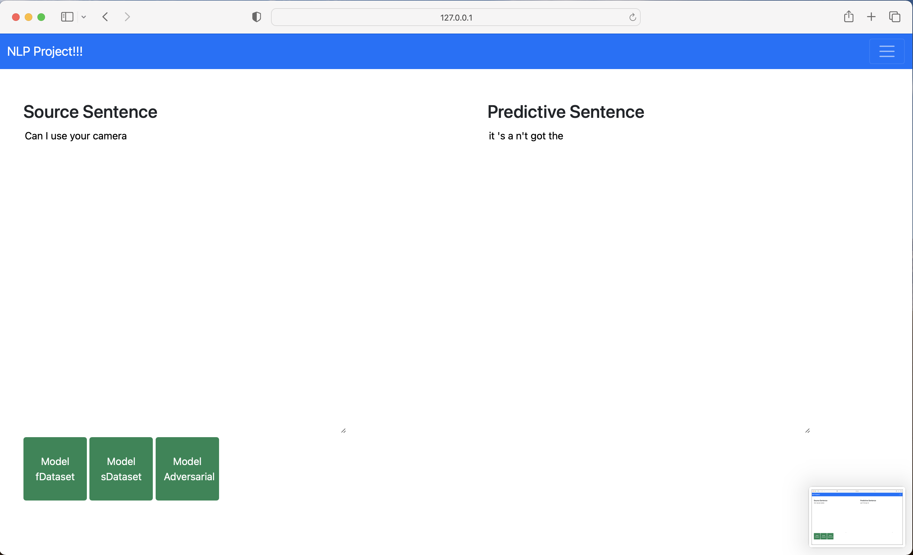

# Paraphase-Generation-with-Non-Parallel-Data
 
## Objectives :

## Member :
```
st123012	Todsavad Tangtortan
st123010	Tonson Praphabkul
st123009    Ati tesakulsiri 
st123418    Rambo SORN
```
-----------------

## Deployment
- ### Predict with Full SynPG


- ### Predict with Small Dataset trained SynPG


- ### Predict with Adversarial SynPG


-----------------------

## Reference :
[Adversarial Example Generation with Syntactically Controlled Paraphrase Networks - SCPNs - 2018](https://aclanthology.org/N18-1170/)

[Style Transformer: Unpaired Text Style Transfer without Disentangled Latent Representation - 2019](https://aclanthology.org/P19-1601/)

[“Transforming” Delete, Retrieve, Generate Approach for Controlled Text Style Transfer - GST - 2019](https://aclanthology.org/D19-1322/)

[Controllable Paraphrase Generation with a Syntactic Exemplar - CGEN - 2019](https://aclanthology.org/P19-1599/)

[Syntax-Guided Controlled Generation of Paraphrases - SGPG - 2020](https://aclanthology.org/2020.tacl-1.22/)

[Reformulating Unsupervised Style Transfer as Paraphrase Generation - STRAP - 2020](https://aclanthology.org/2020.emnlp-main.55/)

[Neural Syntactic Preordering for Controlled Paraphrase Generation - REAP - 2020](https://aclanthology.org/2020.acl-main.22/)

[Generating Syntactically Controlled Paraphrases without Using Annotated Parallel Pairs - SynPG - 2021](https://aclanthology.org/2021.eacl-main.88/)

[Syntactically-Informed Unsupervised Paraphrasing with Non-Parallel Data - 2021](https://aclanthology.org/2021.emnlp-main.203/)

[Using Structured Content Plans for Fine-grained Syntactic Control in Pretrained Language Model Generation - AMR - 2022](https://aclanthology.org/2022.coling-1.514/)

[Unsupervised Syntactically Controlled Paraphrase Generation with Abstract Meaning Representations - AMRPG 2022](https://aclanthology.org/2022.findings-emnlp.111/)

[Quality Controlled Paraphrase Generation - QCPG - 2022](https://aclanthology.org/2022.acl-long.45/)
